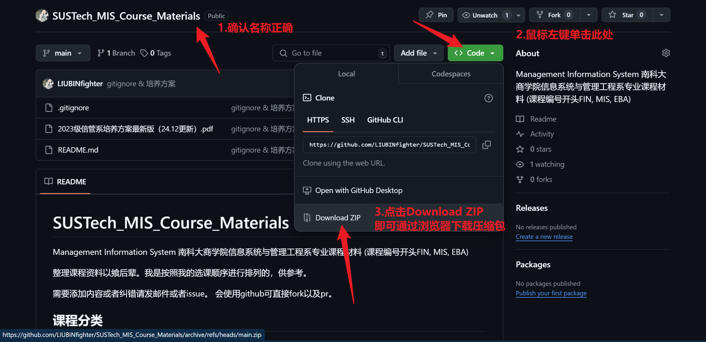

# SUSTech_MIS_Course_Materials
Management Information System 南科大商学院信息系统与管理工程系专业课程材料 (课程编号开头FIN, MIS, EBA)

整理课程资料以飨后辈。我是按照我的选课顺序进行排列的，供参考。

~~我没放上去或者你没看到的不代表没有，也可能是不适合放出来。~~

需要添加内容或者纠错请发邮件或者issue， 会使用github可直接fork以及pr。

下载资料最简单的方法（压缩包）：

## 课程分类

目前以[2023级信管系培养方案最新版（24.12更新）](2023级信管系培养方案最新版（24.12更新）.pdf)为准。

- 导论课 达到2学分即可
- 必修课 按部就班学就好
- 限选课 限选课必须达到9学分
- 选修课 选修课+限选课必须达到15学分

## 课程资料

- 时间 学期
- 课程性质 
- 课程代码 名称
- NCES评教网链接（你可以找到教学大纲，评价和开设学期）

| 课程代码    | 学期  | 课程名称                                              | nce链接                                   | 课程内容                       |
| ------- | --- | ------------------------------------------------- | --------------------------------------- | -------------------------- |
| MIS110  | 春   | 机器学习与大数据分析导论                                      | [链接](https://nces.cra.moe/course/7265/) | slides                     |
| FIN204  | 春   | 宏观经济学 Macroeconimics                              | [链接](https://nces.cra.moe/course/401/)  | slides                     |
| FIN310  | 春   | 中国经济与金融                                           | [链接](https://nces.cra.moe/course/408/)  | reading materials          |
| EBA106  | 秋   | 管理学 Management                                    | [链接](https://nces.cra.moe/course/277/)  | slides                     |
| EBA203  | 秋   | 管理信息系统 Management Information System              | [链接](https://nces.cra.moe/course/2153/) | Lecture slides, lab slides |
| MIS310  | 秋   | 社交网络模型及应用                                         | [链接](https://nces.cra.moe/course/8599/) | Lecture slides, lab slides |
| FIN205  | 秋   | 金融与创业前沿论坛                                         | [链接](https://nces.cra.moe/course/2191/) |                            |
| EBA421  | 秋   | 管理学前沿与实践 II                                       | [链接](https://nces.cra.moe/course/7131/) | Lecture slides             |
| MIS202  | 春   | 营销学 Marketing                                     |                                         |                            |
| MIS204  | 春   | 运筹与决策分析 Prescriptive Decision Analytics           |                                         |                            |
| MIS205  | 春   | 数据管理与数据库 Data Management and Databases            |                                         |                            |
| MIS206  | 春   | 商业数据结构与算法 Business Data Structures and Algorithms |                                         |                            |
| FIN5028 | 春   | 工业革命、内生经济增长以及科学、产权和金融的作用                          |                                         |                            |
| MIS332  | 春   | 区块链基础与实践 Blockchain Essentials and Practices      |                                         |                            |

## 课程修读情况

### 2024 Spring 大一下

#### 导论课

- MIS110 机器学习与大数据分析导论

#### 必修课

- FIN204 宏观经济学 Macroeconimics

#### 选修课

- FIN310 中国经济与金融 （旁听）

### 2024 Fall 大二上

#### 导论课 

- EBA106 管理学 Management

#### 必修课 

- EBA203 管理信息系统 Management Information System

#### 限选课 
- MIS310 社交网络模型及应用

#### 选修课 

- FIN205 金融与创业前沿论坛

- EBA421 管理学前沿与实践 II （旁听）

### 2025 Spring (Future Idea) 大二下

#### 必修课 

- MIS202 营销学 Marketing

- MIS204 运筹与决策分析 Prescriptive Decision Analytics

- MIS205 数据管理与数据库 Data Management and Databases

- MIS206 商业数据结构与算法 Business Data Structures and Algorithms

#### 选修课

- FIN5028 工业革命、内生经济增长以及科学、产权和金融的作用

- MIS332 区块链基础与实践 Blockchain Essentials and Practices

## 外联

- 南科大商学院官网 [南方科技大学商学院 (sustech.edu.cn)](https://business.sustech.edu.cn/)

- 牛蛙评教网 [Niuwa Curriculum Evaluation System (cra.moe)](https://nces.cra.moe/)

- 南科大数学系资料(Inspired by this!) [LunaQu4kez/SUSTech_Math_Course_Materials: Math Course Materials of SUSTech (github.com)](https://github.com/LunaQu4kez/SUSTech_Math_Course_Materials)

- 我自己的课程笔记与项目 
    - EBA203 AI Project [Sample_AI_Workspace: Design a workflow/workspace with obsidian AI plugins and Ollama fine-tunning. AI Term Project for EBA203 Management Information System.](https://github.com/LIUBINfighter/Sample_AI_Workspace)
    - 概统，线性代数与Python的电子书 [Jay_Survival_Manual](https://liubinfighter.github.io/Jay_Survival_Manual/#/)
    - 一些讲座与论坛笔记在博客上 [Huajie's Blog](https://liubinfighter.github.io/Blog/)
	- 其他笔记 [LIUBINfighter/Open_Notes_SUSTech: 南方科技大学一位23级本科生的学习笔记，论文和项目 (github.com)](https://github.com/LIUBINfighter/Open_Notes_SUSTech)
